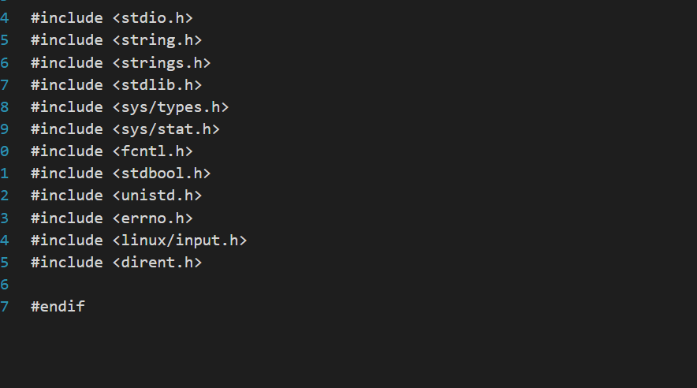

1.代码实现链表反转：1->2->3->4->5通过反转成为5->4->3->2->1

```c
#include <stdio.h>
#include <stdlib.h>

// 定义链表结点结构体
typedef struct ListNode {
    int data;
    struct ListNode *next;
} ListNode;

// 创建新结点
ListNode *createNode(int newdata) {
    ListNode *newNode = (ListNode *)malloc(sizeof(ListNode));
    newNode->data = newdata;
    newNode->next = NULL;
    return newNode;
}

// 打印链表
void printList(ListNode *head) {
    while (head != NULL) {
        printf("%d ", head->data);
        head = head->next;
    }
    printf("\n");
}

// 逆置链表
ListNode *reverseList(ListNode *head) {
    ListNode *prev = NULL;
    ListNode *current = head;
    ListNode *next = NULL;

    while (current != NULL) {
        next = current->next; // 保存下一个结点
        current->next = prev;  // 反转指针
        prev = current;        // 移动到下一个结点
        current = next;        // 继续下一个循环
    }
    return prev;
}

int main() {
    // 创建链表：1 -> 2 -> 3 -> 4 -> 5
    ListNode *head = createNode(1);
    head->next = createNode(2);
    head->next->next = createNode(3);
    head->next->next->next = createNode(4);
    head->next->next->next->next = createNode(5);

    printf("原始链表：");
    printList(head);

    // 逆置链表
    head = reverseList(head);

    printf("逆置后的链表：");
    printList(head);

    // 释放链表内存
    ListNode *temp = head;
    while (temp != NULL) {
        ListNode *next = temp->next;
        free(temp);
        temp = next;
    }

    return 0;
}

```

2.怎样才能检测到链表中存在循环：

限制1：这个链表存在只读内存区域，无法标记；

限制2：内存空间有限，无法创建足够长的数组

限制3：链表长度为任意的，循环位置无法确定

尝试完成代码。

```c
#include <stdio.h>
#include <stdlib.h>


// 定义链表结点结构体
typedef struct ListNode {
    int data;
    struct ListNode *next;
} ListNode;

// 创建新结点
ListNode *createNode(int data) {
    ListNode *newNode = (ListNode *)malloc(sizeof(ListNode));
    newNode->data = data;
    newNode->next = NULL;
    return newNode;
}


// 检测链表是否存在循环的函数
int has_cycle(struct ListNode *head) {
    struct ListNode *slow = head;
    struct ListNode *fast = head;

    while (fast != NULL && fast->next != NULL) {
        slow = slow->next;
        fast = fast->next->next;

        if (slow == fast) {
            return 1;
        }
    }

    return 0;
}

int main()
{
	 // 创建一个带有循环的链表来测试
    struct ListNode node1 = {1, NULL};
    struct ListNode node2 = {2, NULL};
    struct ListNode node3 = {3, NULL};
    struct ListNode node4 = {4, NULL};
    struct ListNode node5 = {5, NULL};

    node1.next = &node2;
    node2.next = &node3;
    node3.next = &node4;
    node4.next = &node5;
    node5.next = &node2;  // 创建循环
	int result = has_cycle(&node1);

	printf(result ? "链表存在循环\n" : "链表不存在循环\n");

    return 0;

}
```

3.对右图中的二叉树，按中根次序遍历(中遍历)得到的结点序列为：   B

A、	ABDEGCFHI

B、	DBGEACHFI

C、	DEGBAFHIC

D、	DGEBHIFCA


4.在数据结构中，结点及结点间的相互关系是数据的逻辑结构，数据结构按逻辑关系的不 同，通常可分为   两类

A

A、	线性结构和非线性结构

B、	动态结构和静态结构

C、	紧凑结构和非紧凑结构

D、	内部结构和外部结构

5.与单向链表相比，双向链表的优点是（多选）

BD

A、	更节省存储空间

B、	便于进行随机访问

C、	可以省略头指针和尾指针

D、	更容易增加和删除结点

6.使用冒泡算法实现对一维数组A中的10个元素进行排序。

```c
#include <stdio.h>

void bubbleSort(int arr[], int n) {
    for (int i = 0; i < n - 1; i++) {
        for (int j = 0; j < n - i - 1; j++) {
            if (arr[j] > arr[j + 1]) {
                // Swap arr[j] and arr[j+1]
                int temp = arr[j];
                arr[j] = arr[j + 1];
                arr[j + 1] = temp;
            }
        }
    }
}

int main() {
    int A[10] = {5, 2, 9, 1, 6, 4, 8, 3, 7, 10};
    int n = sizeof(A) / sizeof(A[0]);

    printf("排序前的数组：\n");
    for (int i = 0; i < n; i++) {
        printf("%d ", A[i]);
    }
    printf("\n");

    bubbleSort(A, n);

    printf("排序后的数组：\n");
    for (int i = 0; i < n; i++) {
        printf("%d ", A[i]);
    }
    printf("\n");

    return 0;
}

```

7.下列是在具有头结点单向列表中删除第i个结点，请在空格内填上适当的语句。

```c
int delete(NODE *head, int i)

{

    NODE *p, *q;

    int j;

    q = head;

    j = 0;

     while((q!=NULL)&&(j<i-1))

    {

        q = q->next;

        j++;

    }

    If(q==NULL)

    return (0);

    (1) ___________________   

    (2)  _________________  

    free(p);

    return (1);

}
```

8.选择排序算法思想

1）首先在未排序序列中找到最小元素，存放到排序序列的起始位置

2）再从剩余未排序元素中继续寻找最小元素，然后放到已排序序列的末尾

 3）重复第二步，直到所有元素均排序完毕

```c
 01 	void selectionSort(int *a, int size)

 02	{

03		int min_inex, min_value, i, j, temp;

04		for(i=0; i<size - 1; i++)

05		{

06			min_index = i;

07			min_value = a[i];

08		for(j=i+1; j<size; j--) // 修正此处的循环条件

09		{

10 		   if(min_value < a[j])// 修正此处的比较条件
 
11 		    {

12			min_value = a[j];

13			min_index = j;

14			}

15			}

16			if(i != min_index)

17			{

18				temp = a[i];

19				a[i] = a[min_inex];

20				a[min_index] = temp;

21			}

		}

}
```

以上程序的错误是？

 第 10 行的比较条件应该是 `min_value > a[j]` 而不是 `min_value < a[j]`。因为选择排序的思想是找到最小的元素，而不是最大的元素。

 第 8 行的 `for` 循环条件应该是 `j=i+1; j<size; j++`，而不是 `j=i+1; j<size; j--`。正确的循环应该是向后遍历剩余未排序的元素，而不是向前遍历。所以修改后的代码如下

9.C语言写个排序算法，并且说明其优缺点。

10.已知一个链表的头节点Node *head，写一个函数把链表逆序。

11.已知二叉树后序遍历序列是dabec，中序遍历序列是debac，它的前序遍历序列是？

12. 已知p指向一个单向链表的某个非空节点，pTemp指向一个独立的新节点。请在不增加

 变量的情况下，写程序实现把pTemp插入到p所指向的节点之后。

 （注：每个节点内有一个next域指向相邻节点）

13.在双向循环链表中，在p所指的结点之后插入s指针所指的结点，其操作是（ ）

A. p->next=s;  s->prior=p;     p->next->prior=s; 	s->next=p->next;

B. s->prior=p;  s->next=p->next;   p->next=s;  	 	p->next->prior=s;

C. p->next=s;  p->next->prior=s;   s->prior=p;  	 	s->next=p->next;

D. s->prior=p;  s->next=p->next;   p->next->prior=s;  	p->next=s;

14.如果进栈的顺序是a，b，c，那可能的出栈的顺序为（ ）

注：进栈过程不一定连续

A.a,b,c

B.b,c,a

C.b,a,c

15.树最适合用来表示（ ）

A.有序数据元素

B.无序数据元素

C.元素之间具有分支层次关系的数据

D.元素之间无联系的数据



